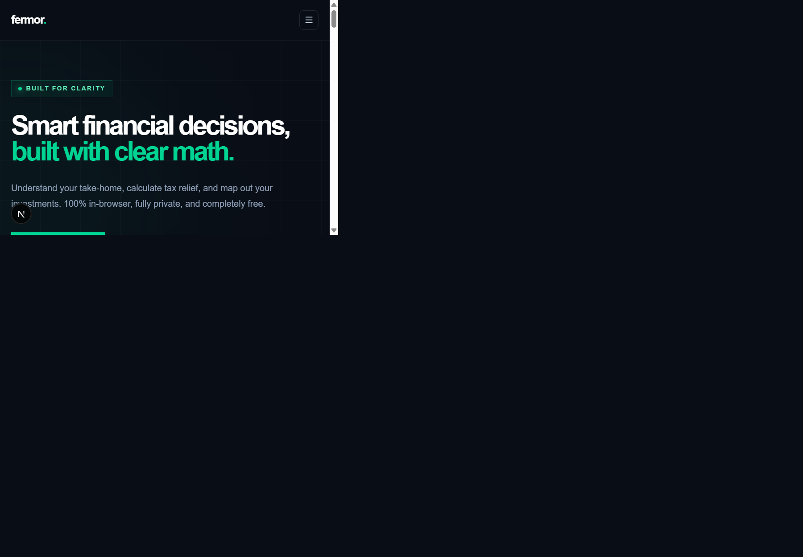

# Fermor

Fermor is a modern personal finance homepage for India, designed around one principle: make financial decisions easier to understand with clear math and strict privacy.

## Screenshots

### Desktop



### Mobile


## Features

- Interactive SIP growth estimator with monthly investment and duration sliders.
- Live SVG growth chart with invested amount, estimated returns, and projected value.
- Understand, Act, and Grow ecosystem section covering local computation, Indian tax nuance, and steady investing.
- Filterable calculator marketplace with animated Framer Motion transitions.
- Responsive layout for desktop, tablet, and mobile breakpoints.
- Privacy-first messaging: calculations stay in-browser and accounts are optional.

## Tech Stack

- Next.js 16 with the App Router
- React 19 and TypeScript
- Tailwind CSS v4
- Framer Motion
- Lucide React

## Getting Started

### Requirements

- Node.js 20 or newer
- npm 10 or newer

### Install

```bash
npm install
```

### Run locally

```bash
npm run dev
```

Open [http://localhost:3000](http://localhost:3000) in your browser.

=======
### Production build

```bash
npm run build
npm run start
```

### Lint

```bash
npm run lint
```

## Project Structure

```text
app/
  globals.css       Global theme, grid texture, and motion styles
  page.tsx          Homepage composition and static sections
components/
  mini-calculator.tsx    Client-side SIP estimator and SVG chart
  tools-marketplace.tsx  Filterable calculator marketplace
public/
  fermor-desktop.png    Captured desktop homepage
  fermor-mobile.png     Captured mobile homepage
```
